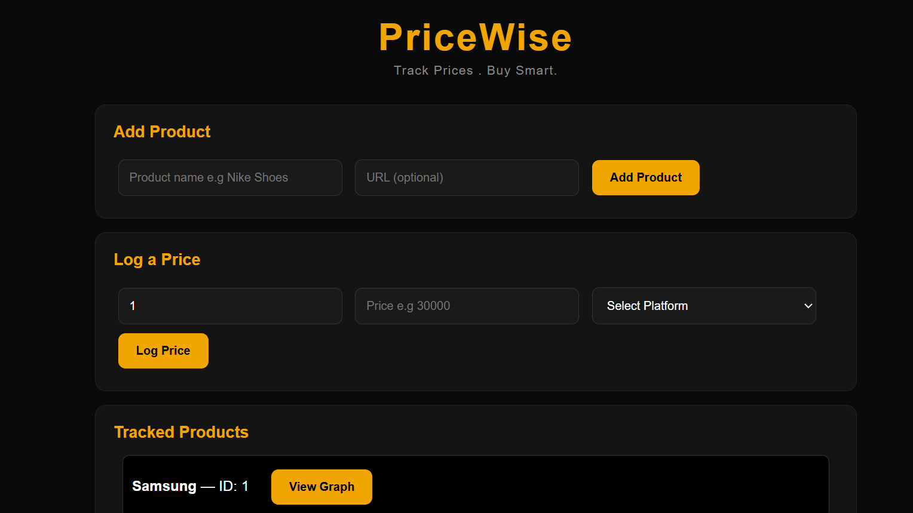
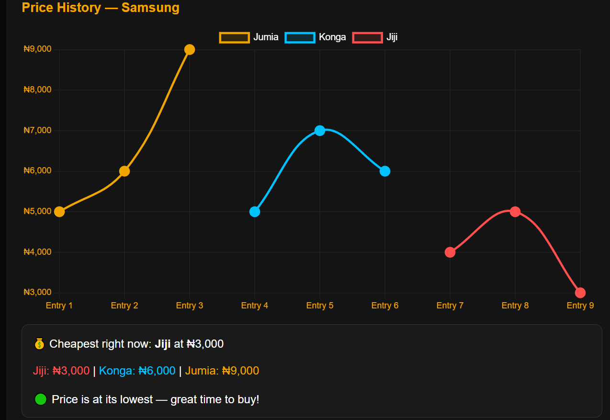

PriceWise 💰
Track Prices. Buy Smart.
PriceWise is a price tracking web app that lets you monitor product prices across Nigerian e-commerce platforms — Jumia, Konga, and Jiji — and tells you the best time to buy.
🔗 Live Demo: pricewise on Render

The Problem
Prices on Nigerian e-commerce platforms change constantly. The same product can be ₦5,000 cheaper on Jiji than on Jumia on the same day. Most people don't track this — they just buy whenever and overpay.
PriceWise fixes that.

What It Does

Add any product you want to track
Log prices manually from Jumia, Konga, or Jiji
View a price history graph per product, colour-coded by platform
Get a smart "Best Time to Buy" insight based on current vs historical prices
Compare prices across platforms side by side

Screenshots

Dashboard with dark theme and platform comparison graph

Show Image
## Screenshots

### Dashboard

### Price History Graph

Tech Stack
LayerTechnologyBackendPython, FlaskDatabaseSQLiteFrontendHTML, CSS, JavaScriptChartsChart.jsDeploymentRenderVersion ControlGitHub

Running Locally
1. Clone the repo
bashgit clone https://github.com/chinms1111-ai/pricewise.git
cd pricewise
2. Install dependencies
bashpip install flask flask-cors
3. Run the app
bashpython app.py
4. Open in browser
http://localhost:5000

API Endpoints
MethodEndpointDescriptionPOST/add_productAdd a new product to trackPOST/log_priceLog a price for a productGET/productsGet all tracked productsGET/history/<id>Get price history for a product

Project Structure
pricewise/
├── app.py              # Flask backend + API routes
├── templates/
│   └── index.html      # Frontend dashboard
├── requirements.txt    # Python dependencies
└── README.md

Built By
Chinemerem-Anthony — a self-taught developer from Anambra, based in Lagos.
Built independently, mostly past 3AM, without formal training.

"I didn't wait to be taught. I just built." 